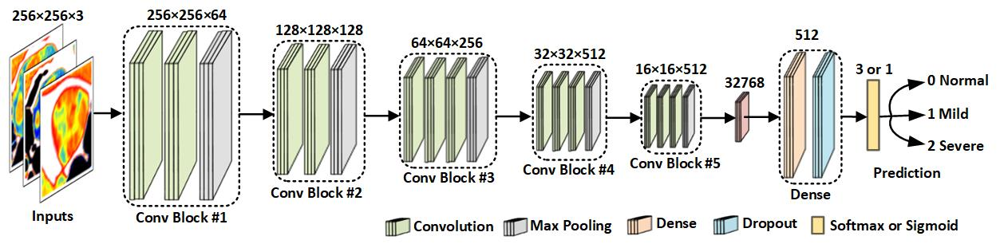
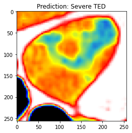

# TEDScreen
Paper: An Artificial Intelligence Model for Screening Computed Tomography Imaging for Thyroid Eye Disease



## Requirements
Python 3.8 <br/>
tensorflow 2.4.0 <br/>
opencv-python 4.5.5

## Pretrained Model
vgg_ted_model.h5 [Google Drive](https://drive.google.com/file/d/1iqStt7Hb2w11dLqgfRPI7Qq1sCKAxsV7/view?usp=sharing)


## Use the Model
````
from tensorflow.keras.models import load_model
import matplotlib.pyplot as plt
import cv2
import numpy as np
from util import *

# load the pretrained model
model = load_model('vgg_ted_model.h5')

# predict the provided image
img_path = 'imgs/img_3.png'
img = cv2.imread(img_path)[:,:,0]

img = resize(img)
pred = np.argmax(model.predict(to_3dimg(img, cm=cmap)))
````

#### Prediction outcome: <br />
````
plt.imshow(img[0], cmap)
plt.title(f'Prediction: {classes[pred]}')
plt.show()
````


## Citation
To be updated ...
